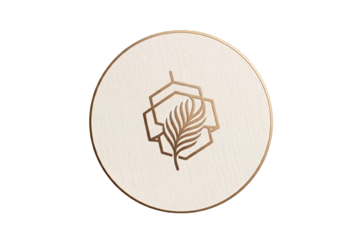

  

  # 🍽️ Calvary • Artisanal Cuisine & Dining
  
  **A state-of-the-art fine dining web platform crafted with Next.js 16, React 19, Tailwind CSS v4, TanStack Query, and Supabase.**

  
  
  
  
  

  > ⚠️ **Disclaimer**: **Calvary is a fictional culinary concept restaurant.** All brand assets, culinary dishes, menus, pricing, customer reviews, chef profiles, and dining details are simulated and generated with AI for demonstration, design exploration, and engineering showcase purposes.

---

## 🌟 Platform Highlights

Calvary is an artisanal fine dining web application engineered for sensory elegance and high-performance booking. Built with an editorial dark luxury aesthetic (saffron gold, charcoal noir, warm ambient glow), it integrates real-time reservations, intelligent collision-free table allocation, visual interactive floor maps, nutrition breakdowns, and concierge communications.

### 🏛️ Visual & Culinary Showcase
- **Artisanal Design System**: Custom typography with *Cinzel*, *Playfair Display*, and *Huninn*, backed by fluid 60fps micro-animations.
- **Cinematic Atmospheric Parallax**: Multi-layered Parallax depth banners across all primary public views.
- **3D Interactive Provenance Globe**: Interactive WebGL earth (`cobe`) showcasing 15 global partner regions and heritage culinary sourcing origins.
- **Micro-interactions & Animations**: Lenis smooth-scrolling, Framer Motion transitions, exploding particle fuse buttons, dynamic counters, and looping testimonial marquees.

---

## ✨ Core Features

### 📅 Smart Table Reservation & Scheduling
- **3-Step Architectural Flow**:
  1. *Date & Time Selection*: Real-time 45-day heatmap density check (`Low`, `Medium`, `High`, `Full`, `Closed`).
  2. *Interactive Table Floor Map*: Live SVG visualizer mapping 14 signature dining tables across 4 exclusive restaurant zones:
     - 🪟 *Window View Bay* (Tables 1–3)
     - 🍷 *Grand Dining Hall* (Tables 4–8)
     - 🕯️ *Artisanal Private Booths* (Tables 9–11 • VIP)
     - 🌿 *Veranda & Garden Patio* (Tables 12–14 • VIP)
  3. *Collision-Safe Table Locking*: Automated conflict checks preventing double bookings.
- **1-Click Calendar Sync**: One-click Google Calendar sync + RFC-5545 `.ics` iCalendar generator for Apple Calendar, Outlook, and mobile devices.
- **Automated Concierge Itinerary**: Automatic email notification with booking reference, table number, dining zone, and valet instructions.

### 📜 Artisanal Menu & Nutrition Engine
- **Dynamic Catalog**: Instant category filtering, vegetarian/non-vegetarian toggles, and live search.
- **Nutritional & Allergen Transparency**: Full caloric profiles, macro split (Protein, Carbs, Fats, Fiber), portion sizing, and advisory alerts.
- **Curated Dish Showcase**: In-depth detail views (`/menu/[item]`) with high-definition photography, portion breakdowns, and chef pairing notes.

### 🔐 Email OTP Authentication & Guest Profile
- **Passwordless Authentication**: 6-digit email OTP delivery via Supabase Auth with custom slot progress inputs (`input-otp-9`).
- **Profile Dashboard (`/profile`)**:
  - Avatar management with cloud asset storage.
  - Interactive luxury Birthday Calendar selector (`simple-calender`).
  - Read-only verified email credentials and editable mobile coordinates.
  - Account erasure and data sanitization safeguards.

### 🛎️ Guest Booking Manager (`/my-bookings`)
- **Booking Oversight**: Real-time status tags (`Confirmed`, `Pending Approval`, `Completed`, `Cancelled`).
- **Alterations & Cancellations**: In-place table rescheduling modal with live slot recalculation.
- **Dining Reviews & Ratings**: 1-to-5 star gold review modal with direct culinary notes for past visits.
- **Date Range Filtering**: Luxury range picker (`DatePicker6`) powered by `react-day-picker` and `little-date`.

### 🛡️ Admin & Maître D' Console (`/admin`)
- **Control Center Hub**:
  - Live metric counters strip (Pending requests, confirmed locks, today's arrivals, total volume).
  - Quick approval with instant guest confirmation dispatch.
  - Rejection modal with optional guest explanation notices.
  - Bespoke Concierge Email Reply modal for direct inquiries.
- **Menu Catalog Manager**: Create, edit, toggle availability (`In Stock` / `Unavailable`), and assign macro nutrients to culinary dishes.
- **Gallery Manager**: Curate visual assets across categories (*Dishes*, *Cocktails*, *Ambiance*, *Kitchen Craft*).
- **Inquiry Inbox**: Manage and reply to guest contact messages directly.

---

## 🏗️ Tech Stack

| Domain | Technology |
| :--- | :--- |
| **Framework** | [Next.js 16](https://nextjs.org/) (App Router, React 19, TypeScript) |
| **Styling** | [Tailwind CSS v4](https://tailwindcss.com/), `@tailwindcss/postcss`, Custom Design System |
| **Data Fetching** | [TanStack Query v5](https://tanstack.com/query/latest) (React Query) |
| **Backend & DB** | [Supabase](https://supabase.com/) (PostgreSQL, Row Level Security, Auth, Storage) |
| **Email Service** | [Brevo](https://www.brevo.com/) (`@getbrevo/brevo`) |
| **Animations** | [Framer Motion](https://www.framer.com/motion/), [Motion](https://motion.dev/), [Lenis](https://lenis.darkroom.engineering/) (Smooth Scroll) |
| **UI Components** | Lucide React, Hugeicons, Base UI, Radix-based primitives, Sonner |
| **Date & Calendar** | `date-fns`, `react-day-picker`, `little-date`, Custom `DatePicker6` |
| **3D Graphics** | [Cobe](https://github.com/shuding/cobe) (WebGL Interactive Globe) |

---

## 📡 REST API Ecosystem

All client components communicate through standardized RESTful endpoints under `/api/*`:

| Method | Endpoint | Description | Access |
| :--- | :--- | :--- | :--- |
| `GET` | `/api/menu` | Retrieve dishes and categories with nutrition macros | Public |
| `POST` | `/api/menu` | Create or update culinary dish | Admin |
| `DELETE` | `/api/menu?id=:id` | Remove menu item | Admin |
| `GET` | `/api/reservations` | Fetch guest or admin reservations | Authenticated |
| `POST` | `/api/reservations` | Create collision-safe booking | Authenticated / Guest |
| `GET` | `/api/reservations/availability?date=:date` | Query real-time table & slot availability | Public |
| `GET` | `/api/reservations/calendar` | 45-day heatmap occupancy density | Public |
| `PATCH` | `/api/reservations/:id` | Action: `approve`, `reject`, `alter`, `cancel`, `email` | Dynamic |
| `POST` | `/api/reservations/:id/reminder` | Send 1-click dining itinerary email | User |
| `POST` | `/api/reservations/:id/review` | Submit 1–5 star dining rating and chef feedback | User |
| `GET / PATCH` | `/api/profile` | Retrieve or update user coordinates | Authenticated |
| `POST` | `/api/contact` | Submit guest inquiry with Brevo auto-reply | Public |

---

## 📜 License

Distributed under the MIT License. See `LICENSE` for more information.

---

  Calvary is a fictional fine dining experience engineered for digital design and showcase exploration.

